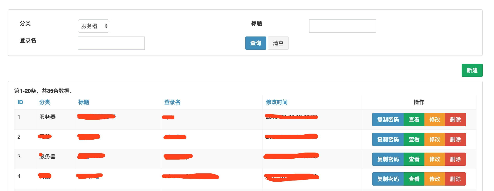
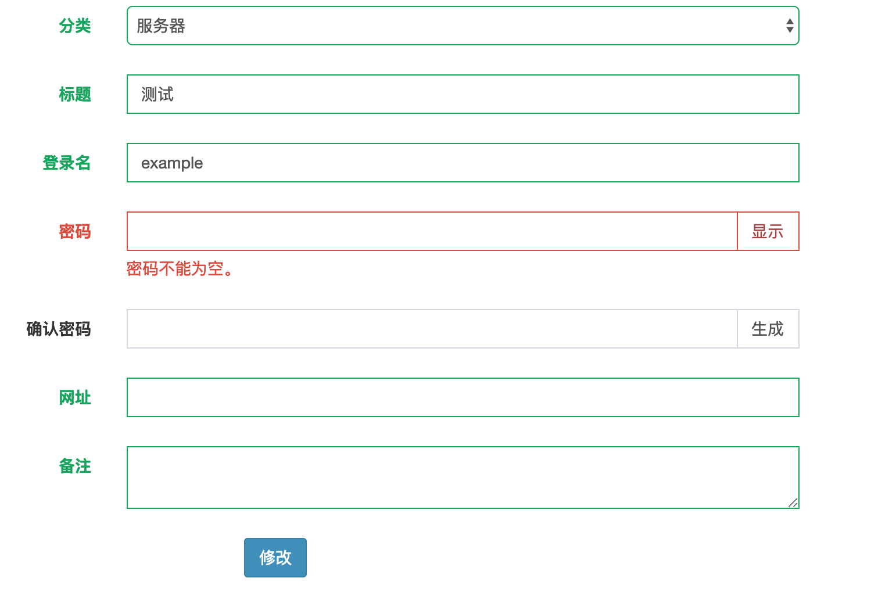

# yii2-passwd
========================

基于yii2框架的密码管理

在正常的创业中，公司中会存在大量的密码需要管理。虽然keepasswd等工具能帮助我们管理密码，但是密码并不是共享的，导致几个核心员工之间需要大量的沟通和交流。本处利用了yii2框架来实现了一个集中式管理的密码账本，方便大家使用。
主要功能特性：

 - 基本的权限控制
 - 数据库采用随机盐方式，保证数据库安全。
 - 加密解密方式均开源且可自行配置，保证安全。
 
在此处可以查看本扩展的[许可](LICENSE.md)

示例
-----
页面上整个密码的列表

修改或添加密码的示例，支持自动生成随机密码。



安装
------------

推荐的方式是通过composer 进行下载安装[composer](http://getcomposer.org/download/)。

在命令行执行
```
php composer.phar require "ethercap/passwd" "~1.0.0"
```

或加入

```
"ethercap/passwd": "~1.0.0"
```

到你的`composer.json`文件中的require段。

使用
-----

**module配置**

一旦你安装了这个插件，你就可以直接在yii2的配置文件中加入如下的代码：


```php
return [
    'modules' => [
        'passwd' => [
            'class' => '\ethercap\passwd\Module',
            //允许查看密码页面的用户id,可以为function
            'allowUserIds' => YII_DEBUG ? [1] : [1,2,3],
            //数据库加密的盐，建议由标点，大小写字母，数字组成
            'salt' => '#@!D1s^$&',
            //使用的数据库
            'db' => 'db',
            //加密方式，可以不配置，使用默认的加密
            'encodePasswd' => function($passwd, $key, $salt){
                return 'xxx';    
            }
            //解密方式，可以不配置，使用默认的解密
            'decodePasswd' => function($encrypt, $key, $salt) {
                return 'xxx',
            }
         ],
    ],
];
```

注意：

 - 为了安全，本插件要求必须配置salt。
 - 各位可以自行配置加解密算法。如果不配置，会使用默认的加解密算法。默认采用的是Yii2自带的encryptByPassword方法，大家可以放心使用。

**数据库配置**

你需要在数据库建立对应的密码表，sql在src/sql/passwd.sql中，可以通过数据库导入，建立相应的数据库表。

**使用**

通过上述的操作，我们就可以使用密码本了。访问http://yourdomain.com/passwd ，我们就可以看到对应的效果了，祝使用愉快。如果有任何功能建议，欢迎联系我们。


广告
--------------

 我们是一群热爱技术，追求卓越的极客，我们乐于做一些对整个社会都有作用的事情，我们希望通过我们的努力来推动整个社会的创新，如果你也一样，欢迎加入我们（service@ethercap.com）！你也可以通过https://tech.ethercap.com 来了解更多！
